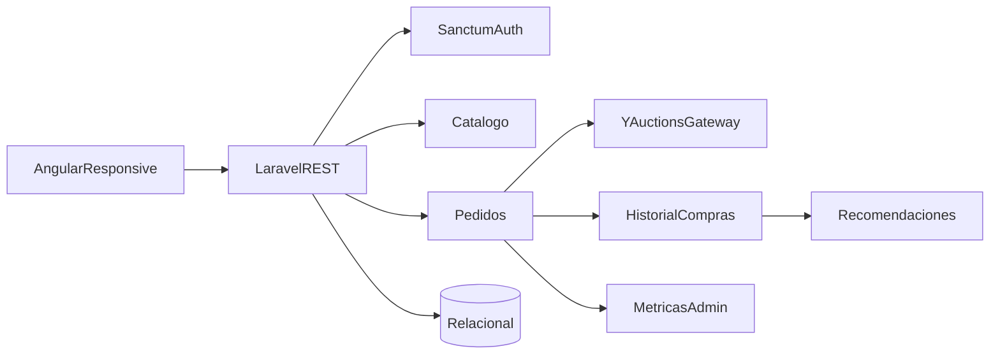

# Propuesta de arquitectura de CompraLatino

## Alcance de la primera versión

CompraLatino se implementa como una SPA Angular 21 que consume una API REST Laravel 13. Laravel mantiene autenticación, catálogo, pedidos, recomendaciones y métricas; Angular mantiene la experiencia responsive para computadoras, tablets y smartphones.

## Requisitos y componentes

| Necesidad | Solución |
| --- | --- |
| Crear cuenta | `POST /api/auth/register`, validación, contraseña cifrada y token Sanctum. |
| Buscar y comprar desde varios dispositivos | SPA responsive, API paginada y token Bearer; el precio se recalcula en servidor. |
| Ejecutar compras con YAuctions | `YAuctionsGateway`, una interfaz que desacopla pedidos del proveedor externo. |
| Ofrecer productos por historial | `GET /api/recommendations`, agrupando categorías compradas y excluyendo artículos adquiridos. |
| Administración y monitoreo | roles `customer/admin` y `GET /api/admin/metrics`. |

## Seguridad y datos

Las rutas privadas usan `auth:sanctum`; las administrativas usan además `role:admin`. El registro público fuerza el rol `customer`. Los pedidos guardan el nombre y precio del producto al momento de comprar para conservar un historial auditable aunque cambie el catálogo.

## Decisiones y pendientes

- SQLite queda para desarrollo; producción debe usar PostgreSQL o MySQL.
- El gateway actual es `FakeYAuctionsGateway`; no se deben enviar credenciales desde Angular.
- Faltan pago real, verificación de correo, recuperación de contraseña y un panel administrativo visual.
- Las observaciones del docente deben agregarse aquí sin borrar las versiones anteriores.
