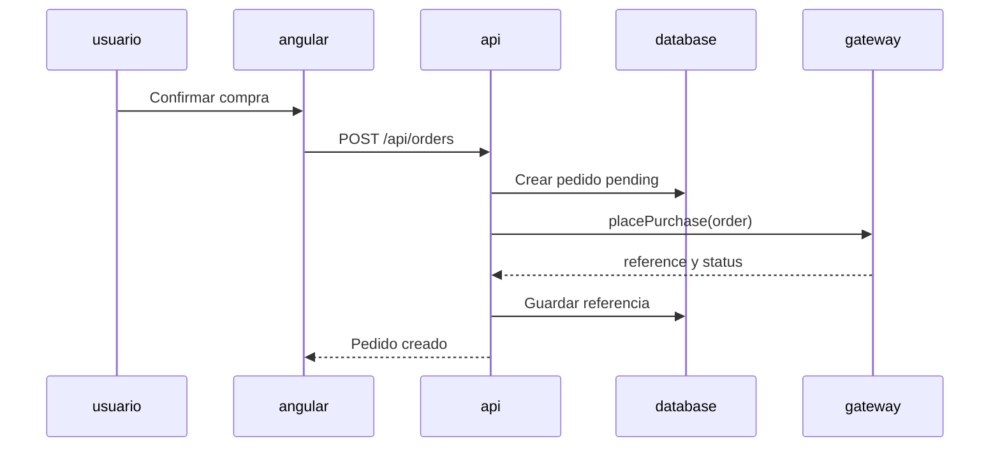

# Integración con YAuctions

## Hallazgo

YAuctions se interpreta como Yahoo Auctions Japan (ヤフオク). La API pública de Yahoo Auctions dejó de estar disponible para uso general en enero de 2018. El acceso oficial actual es contractual. Existen terceros como Apify o Parse.bot, pero agregan costo, dependencia y posibles restricciones de uso.

## Diseño implementado

El dominio depende de `YAuctionsGateway`, no de un SDK ni de una URL concreta:

`FakeYAuctionsGateway` permite desarrollar y probar sin tráfico externo. Cuando exista autorización, se agrega un adaptador HTTP que implemente la misma interfaz. El controlador de pedidos no cambia.

## Opciones para producción

1. **Contrato directo con Yahoo Japan:** opción preferida si el negocio obtiene acceso oficial.
2. **Proveedor tercero:** Apify/Parse u otro proveedor con contrato, límites y monitoreo. Debe encapsularse en un adaptador.
3. **Intermediario de compras:** útil si el flujo comercial delega compra, pago y envío; requiere confirmar comisiones y condiciones.

No se recomienda scraping propio: es frágil, puede incumplir términos y dificulta garantizar disponibilidad.

## Riesgos y controles

- Usar `Idempotency-Key` para no duplicar pedidos.
- Mantener estados `pending`, `submitted`, `completed` y `failed`.
- Reintentar de forma controlada cuando el proveedor no responda.
- Guardar referencia externa y trazabilidad, nunca credenciales en el frontend.
