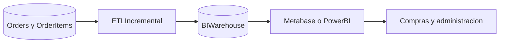

# Solución de inteligencia de negocios

## Objetivo

Convertir pedidos e interacciones en información para decidir qué importar, qué categorías recomendar y cómo monitorear ventas.

## Arquitectura y estructuras

La primera versión expone métricas agregadas desde Laravel. La evolución recomendada es un almacén analítico separado:

Modelo dimensional propuesto:

- `fact_sales`: pedido, producto, cliente, fecha, cantidad, precio, comisión y total.
- `dim_product`: producto, categoría, estado y referencia YAuctions.
- `dim_customer`: usuario, país y segmento.
- `dim_date`: día, mes, trimestre y año.
- `dim_category`: categoría y familia.

Para una primera entrega, PostgreSQL con un job ETL programado es suficiente. Metabase reduce el tiempo para prototipos; Power BI es una alternativa si la institución ya tiene licencias.

## Prototipos descriptivos

1. **Panel ejecutivo:** ventas totales, pedidos, comisión, ticket promedio y variación mensual.
2. **Catálogo:** top productos, top categorías, artículos agotados y conversión de destacados.
3. **Clientes:** compras por país, frecuencia, recencia y valor acumulado.
4. **Operación YAuctions:** pedidos por estado, fallas del gateway, tiempo pendiente y referencias externas.
5. **Recomendaciones:** categorías dominantes, productos sugeridos y compras posteriores a una recomendación.

La primera versión implementa el prototipo del panel ejecutivo en `/admin`: tarjetas de ventas, pedidos, clientes y productos; además de ventas por día, estados de pedidos y productos más vendidos. El mismo panel incorpora la vista operativa del catálogo.

## Conclusiones y recomendaciones

La base transaccional ya conserva el precio congelado y el historial necesario para análisis. Se recomienda no consultar el warehouse desde el checkout, separar cargas analíticas de la API operacional, anonimizar datos sensibles y definir indicadores con el docente antes de construir el dashboard final.

## Observaciones acumulativas

| Fecha | Observación | Ajuste |
| --- | --- | --- |
| 2026-10-09 | Primera propuesta | Pendiente de revisión docente. |
| 2026-10-10 | Panel administrativo inicial | Se implementó dashboard operativo y CRUD de productos; queda validar indicadores con el docente. |
